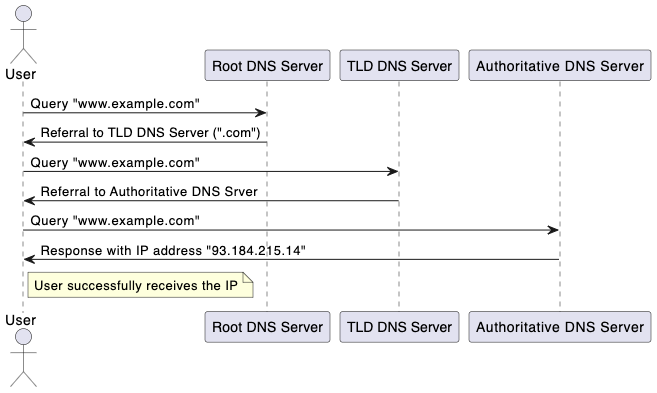

# DNS Hierarchy Demo

This project demonstrates the DNS hierarchy concept by querying DNS servers to resolve a domain name. It illustrates how DNS resolution works from the root level through various domains (TLD, SLD, and subdomains) until a final answer is obtained or the query is referred to the next authoritative server.

## Overview

The Domain Name System (DNS) translates human-readable domain names (e.g., `www.example.com`) into IP addresses that computers use to identify each other on the network. The DNS hierarchy is structured as follows:

1. **Root DNS Servers**: The topmost level in the DNS hierarchy.
2. **Top-Level Domains (TLDs)**: Examples include `.com`, `.org`, `.net`, etc.
3. **Second-Level Domains (SLDs)**: These are directly below TLDs (e.g., `example` in `example.com`).
4. **Subdomains**: Additional domains below SLDs (e.g., `www` in `www.example.com`).

This demo queries DNS servers starting from the root level and follows the hierarchy to resolve the given domain name.

## DNS Hierarchy Diagram




## Features

- Randomly selects a root DNS server from a predefined list.
- Constructs and sends DNS queries to resolve a domain name.
- Parses DNS responses to determine if an authoritative answer is provided or if referral to another DNS server is needed.
- Recursively follows the DNS hierarchy to resolve domain names.

## Usage

### Prerequisites

Ensure you have Go installed on your system. If not, you can download and install it from [golang.org](https://golang.org/dl/).

### Installation

Clone the repository:

```bash
go run main.go
```

### Example Output
```
[Root] Querying DNS server: 198.41.0.4 for domain: www.example.com
No answer found, checking for referrals in authority section
NS record found: l.gtld-servers.net, TTL: 172800
Next Server: l.gtld-servers.net
[Root] Referring to next DNS server: l.gtld-servers.net

[TLD] Querying DNS server: l.gtld-servers.net for domain: www.example.com
No answer found, checking for referrals in authority section
NS record found: a.iana-servers.net, TTL: 172800
Next Server: a.iana-servers.net
[TLD] Referring to next DNS server: a.iana-servers.net

[SLD] Querying DNS server: a.iana-servers.net for domain: www.example.com
Answer found in response
A record found: 93.184.215.14, TTL: 3600
Final Answer: 93.184.215.14
[SLD] Received authoritative answer for domain: www.example.com.
```

## Code Explanation

- **DNSHeader**: Represents the DNS header section of a DNS query. It contains fields such as Transaction ID, Flags, Number of Questions, Answer Records, Authority Records, and Additional Records.

- **DNSQuestion**: Represents the DNS question section of a DNS query. It includes the encoded domain name, query type (e.g., A record for IPv4 addresses), and query class (e.g., IN for Internet).

- **encodeDNSName**: Encodes a domain name into the DNS query format. It converts the domain name into a format suitable for DNS queries, where each part of the domain is prefixed with its length.

- **sendDNSQuery**: Sends a DNS query to a specified DNS server and receives the response. It handles the UDP connection to the DNS server, sends the query, and reads the server's response.

- **createDNSQuery**: Constructs a DNS query packet. It combines the DNS header and question sections into a single byte buffer that can be sent to a DNS server.

- **parseDNSResponse**: Parses the DNS response to determine if an answer is available or if a referral to another DNS server is needed. It checks the answer section for a valid response or the authority section for referral details.

- **queryDNSHierarchy**: Recursively queries DNS servers following the DNS hierarchy. It starts with a root server and continues querying TLD, SLD, and subdomain servers as needed to resolve the domain name.

- **incrementLevel**: Increments the DNS query level (Root, TLD, SLD, Subdomain). It adjusts the query level to reflect the current stage in the DNS resolution process.
